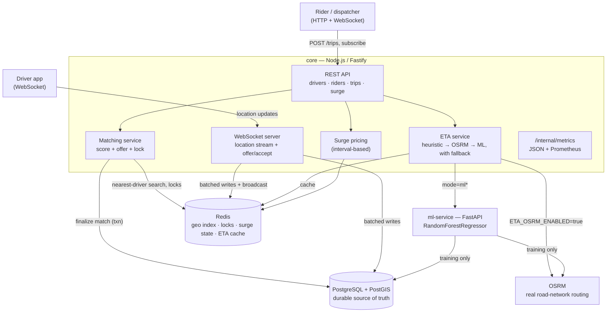

# ride-tracking

A ride/location-tracking & ETA engine: live driver location streaming, nearest-driver matching,
an ML-based ETA model (with a real-road-network routing feature), dynamic surge pricing, and a
from-scratch spatial index — built in 16 incremental phases, each with real, live-verified
results rather than aspirational claims. See `PROMPTS.md` for the full phase-by-phase build log.

- `/core` — Node.js + TypeScript (Fastify) service: REST API, WebSocket server, matching, ETA,
  surge pricing.
- `/ml-service` — Python + FastAPI service: the trained ETA model (training + serving).
- `/infra` — docker-compose stack: PostgreSQL (PostGIS), Redis, OSRM, and both services.

## Architecture



Two architectural principles run through the whole system, documented in detail in `docs/`:

- **Durable vs. live state**: Postgres is always the source of truth; Redis holds fast,
  ephemeral, derived state (live geo index, distributed locks, surge multipliers, cached ETAs)
  that can be flushed and rebuilt from Postgres + fresh signals without data loss
  (`docs/redis-geo.md`).
- **Typed fallback, not a one-off try/catch**: every external call on a hot path (ml-service's
  `/predict-eta`, OSRM's `/route`) uses the same discriminated-result client pattern —
  `{ok:true,...} | {ok:false, reason, detail}` — with a hard timeout and an explicit fallback,
  first built in Phase 10 (`docs/eta-integration.md`) and reused unchanged for OSRM in Phase 15
  (`docs/osrm-routing.md`).

Database schema (ER diagram): `docs/schema.md`.

## Prerequisites

- Docker Engine 24+ with Compose v2 (`docker compose version`)
- Node.js 20+ (for local, non-Docker development of `/core`)
- Python 3.12+ (for local, non-Docker development of `/ml-service`)

## Quickstart

```
make up
```

(equivalently: `npm run up`)

This builds and starts Postgres, Redis, OSRM, `core`, and `ml-service` on a shared Docker
network, with no manual setup steps for the core system. Working `.env` files with local-dev,
non-secret defaults are already present next to each service's `.env.example` (gitignored —
regenerate from the `.env.example` files if missing).

Other commands:

```
make down    # stop and remove containers
make logs    # follow logs from all services
make ps      # list running services
make clean   # stop services and remove volumes (drops the Postgres data volume)
```

**One real caveat, not swept under the rug**: on a genuinely fresh checkout, the `osrm` container
will exit immediately (`Required files are missing, cannot continue` — confirmed by actually
removing `infra/osrm-data/` and running `docker compose up -d osrm`) because its map data isn't
generated yet. **This does not break the rest of the stack** — `core` doesn't `depends_on` OSRM,
and `ETA_OSRM_ENABLED` defaults to `false`, so `postgres`/`redis`/`core`/`ml-service` all come up
and work normally regardless. To actually use the OSRM routing feature, generate its dataset once
first:

```
bash infra/scripts/prepare-osrm-data.sh   # ~95s, fetches + preprocesses a real SF road network
docker compose -f infra/docker-compose.yml up -d osrm
```

## Verify it's working

```
curl http://localhost:3000/health   # core
curl http://localhost:8000/health   # ml-service

# cross-service reachability by Docker service name (not localhost)
docker compose -f infra/docker-compose.yml exec core curl -sS http://ml-service:8000/health
docker compose -f infra/docker-compose.yml exec ml-service curl -sS http://core:3000/health

# PostGIS is actually enabled, not just installed
docker compose -f infra/docker-compose.yml exec postgres \
  psql -U ridetracking -d ridetracking -c "SELECT PostGIS_version();"
```

## Feature tour

| Feature | What | Docs |
| --- | --- | --- |
| Live location tracking | WebSocket driver streaming, per-driver throttle, fleet-wide batching, delta-compressed broadcasts | `docs/websockets.md`, `docs/ws-batching-and-compression.md` |
| Nearest-driver matching | Redis Geo search, scored ranking, offer/accept over WebSocket, double-booking prevention (Redis lock + guarded Postgres transaction) | `docs/matching.md`, `docs/redis-geo.md` |
| ETA | Haversine+rush-hour heuristic → OSRM road-network routing → ML model, each with a typed timeout/fallback to the previous | `docs/eta.md`, `docs/eta-integration.md`, `docs/osrm-routing.md` |
| ML ETA model | RandomForestRegressor trained on simulated historical trips, evaluated against two baselines on a chronological (not random) split | `docs/eta-model.md`, `docs/historical-data-simulator.md` |
| Surge pricing | Geohash-zoned, interval-recomputed multiplier with smoothing and floors/ceilings, factored into fare estimates | `docs/surge-pricing.md` |
| Custom spatial index | From-scratch geohash bucket index, benchmarked head-to-head against Redis GEO — not wired into production | `docs/custom-geo-index.md` |
| Multi-region sharding | Per-region Redis logical DBs, boundary-aware cross-shard queries, live migration — not wired into production | `docs/sharding.md` |
| Load testing | Real WebSocket fleet + concurrent trip-request load generator, a found-and-fixed Postgres pool bottleneck | `docs/load-testing.md` |
| Observability | Structured JSON logging (both services) + a Prometheus metrics endpoint exposing the numbers below live | `docs/observability.md` |

## Results

Every number below is measured on this exact system and traceable to a specific test, script, or
log — not an estimate. See the **Known limitations** section right after for the environment this
was measured in and what it doesn't prove.

| Claim | Number | Source |
| --- | ---: | --- |
| WebSocket bandwidth savings (delta compression) | **26.5%** (163.1B → 119.9B/message, real 1,000-driver run) | `docs/ws-batching-and-compression.md` § "Bandwidth: measured, not guessed"; reproduce with `cd core && npm run load-test:fleet`; unit-level correctness in `core/test/ws-delta-compression.test.ts` |
| Sustained location-update throughput | **~2,500 updates/sec** (5,000 drivers × 1 update/2s, zero Postgres pool queueing) | `docs/load-testing.md` § "Max sustained throughput"; reproduce with `cd core && npm run load-test:system`; live in `curl http://localhost:3000/internal/metrics/prometheus` → `location_updates_processed_total` |
| Load-test bottleneck found & fixed | `pgPool.waitingCount` **3,292 → 0** at 5,000 drivers (broadcast p99 latency **986ms → 671ms**, −32%) | `docs/load-testing.md` § "Before / after"; regression coverage in `core/test/eta-batch.test.ts` |
| Trip-matching latency (post-fix, 5,000-driver load) | p50 **26ms**, p99 **409ms** | `docs/load-testing.md` § "Before / after"; live in `/internal/metrics/prometheus` → `trip_matching_latency_seconds` |
| ETA model vs. rush-hour-aware heuristic baseline | **−70.8% MAE** (123.1s vs. 421.6s, 1,000-trip chronological test set) | `docs/eta-model.md` § "Real results"; reproduce with `docker compose exec ml-service python scripts/train_model.py`; regression coverage in `ml-service/tests/test_baselines.py` |
| ETA model vs. naive (no-adjustment) baseline | **−76.9% MAE** (123.1s vs. 532.0s) | `docs/eta-model.md` § "Real results" |
| OSRM road-network duration as an added ETA feature | **−0.3% MAE** (123.1s → 123.5s — did *not* help; see Known limitations) | `docs/osrm-routing.md` § "Real captured run"; regression coverage in `ml-service/tests/test_osrm_client.py` |
| Custom geohash index vs. Redis GEO — writes | **18–25x faster** at every scale tested (100 / 1,000 / 100,000 points) | `docs/custom-geo-index.md` § "Insert (write) latency"; reproduce with `cd core && npm run benchmark:geo` |
| Custom geohash index vs. Redis GEO — reads at scale | Redis **~10x** faster (radius search) / **~350x** faster (KNN) at 100,000 points, due to a documented fixed-bucket-precision limitation | `docs/custom-geo-index.md` § "Honest analysis: where each one wins, and why" |
| Test suite size | **198 tests** (26 files) in `core`, **39 tests** (7 files) in `ml-service`, all passing | `cd core && npm test`; `cd ml-service && pytest` |

## Known limitations

Honest, not marketing copy — several things here are explicitly out of scope or simplified, and
are documented as such in the relevant phase's own doc rather than glossed over.

- **All training/historical data is synthetic.** There is no live GPS or traffic feed. Phase 8's
  simulator (`docs/historical-data-simulator.md`) generates `training_trips` from haversine
  distance plus a documented circuity factor, time-of-day multiplier, a zone-density-from-center
  proxy, and noise — not real road geometry or real traffic. This is directly why adding OSRM's
  *real* road-network duration as an ML feature didn't help (`docs/osrm-routing.md`): the
  synthetic ground truth was never derived from real road data in the first place, so a more
  realistic feature has nothing extra to correlate with. Day-of-week is computed correctly but
  carries ~0 feature importance for the same reason (the simulator doesn't inject a day-of-week
  demand signal).
- **Driver rating/acceptance-rate is a stub.** `getDriverRatingScore` (`docs/matching.md`) returns
  a deterministic pseudo-random score derived from the driver's id — structured so a real
  aggregated-rating implementation can swap in later, but there is no real rating data behind it
  today.
- **Driver "authentication" is identification, not authentication.** A driver connects to
  `/ws/driver?driverId=<uuid>` with no signed token or session proof (`docs/websockets.md`) — a
  production version would validate a real JWT/session token issued at login.
- **OSRM coverage is a single bounding box.** The routing dataset (`infra/scripts/prepare-osrm-data.sh`)
  covers only this project's simulated San Francisco bbox — a pickup/dropoff outside it has no
  route at all, and the extract has no live traffic data (OSRM's duration is a free-flow estimate;
  core layers the same rush-hour multiplier on top regardless of source, see `docs/osrm-routing.md`).
- **Load testing was single-machine, not a distributed benchmark.** All numbers above (throughput,
  latency, the pool-exhaustion bottleneck) were measured on one 8-core/8GB dev laptop with Docker
  Desktop's resource limits, competing with the load generator for the same CPUs
  (`docs/load-testing.md` § "Test environment") — real, repeatable, but not a claim about
  dedicated-hardware ceilings. 10,000 concurrent driver connections was explicitly attempted and
  did **not** succeed cleanly — see the Resume bullets section below.
- **The custom geohash spatial index and the multi-region sharding module are not wired into the
  live matching path.** Both are real, fully tested, benchmarked-with-real-numbers standalone
  modules (`docs/custom-geo-index.md`, `docs/sharding.md`) built to demonstrate the underlying
  mechanics — Redis GEO remains the actual production geo index.
- **Surge pricing computes a fare *estimate* only.** The actual fare a rider would be charged
  post-trip (using real final distance/duration) is out of scope (`docs/surge-pricing.md`).
- **Rush-hour multiplier uses server-local time, not per-trip timezone**, and the multiplier table
  itself is a documented placeholder loosely based on published commute-congestion research, not
  calibrated to this project's own (synthetic) traffic — see `docs/eta.md`'s "Known limitation"
  section and `core/src/services/eta-heuristic.ts`'s doc comment.
- **`/internal/metrics*` is unauthenticated and unversioned by design** — a dev/ops diagnostic
  endpoint for a single-tenant project at this stage, not something to expose outside a trusted
  network as-is.

## Resume bullets — rewritten against real numbers, not the original placeholders

The original project brief (`PROMPTS.md`) named a couple of specific numbers as resume-bullet
targets before any of this was built — most explicitly, a "10K location updates/sec" claim
(Phase 11) and "a real measured number, not a guess" for bandwidth savings (Phase 5). Below is
each implied bullet, rewritten with what this build actually measured — cut or softened wherever
the number didn't hold up, per Phase 16's own acceptance criteria.

**Kept, with the real number substituted in:**

- Built a real-time ride-tracking backend (Node.js/Fastify, WebSockets, Redis Geo, PostGIS)
  sustaining **~2,500 location updates/sec** across 5,000 concurrent driver connections on a
  single dev machine, after finding and fixing a Postgres connection-pool exhaustion bottleneck
  (`pgPool.waitingCount` 3,292 → 0, p99 broadcast latency −32%) — `docs/load-testing.md`.
- Cut WebSocket bandwidth by **26.5%** via delta-compressed location broadcasts (quantized
  lat/lng deltas + omit-unchanged-fields), measured on a real 1,000-driver load test, not
  estimated — `docs/ws-batching-and-compression.md`.
- Trained an ML ETA model (scikit-learn RandomForestRegressor) that beats a rush-hour-aware
  heuristic baseline by **70.8% MAE** and a naive distance/speed baseline by **76.9% MAE** on a
  chronologically held-out test set — `docs/eta-model.md`.
- Designed and implemented double-booking-proof trip matching under concurrent requests, using a
  Redis distributed lock as the primary defense and a guarded Postgres transaction as
  defense-in-depth, verified with a concurrent-race test (`test/matching.test.ts`) —
  `docs/matching.md`.
- Built a from-scratch geohash-bucket spatial index and benchmarked it against Redis GEO at three
  scales, finding it 18–25x faster on writes (no network hop) but up to 350x slower than Redis on
  dense-read KNN queries at 100,000 points — and diagnosed *why* (a fixed bucket-precision
  simplification), rather than only reporting the scenario where it wins —
  `docs/custom-geo-index.md`.

**Flagged as unverifiable and explicitly cut, per this phase's own acceptance criteria** — this is
the one the brief most directly asked for a number on:

- ~~"Handled 10,000 location updates/sec."~~ **Cut.** The verified, repeatedly-reproduced ceiling
  on this hardware is ~2,500 updates/sec (5,000 drivers at a realistic 2s GPS interval) with zero
  connection-pool queueing. 10,000 concurrent driver connections was explicitly attempted, not
  assumed away, across three separate attempts: the first (default connection-setup concurrency)
  failed outright (`ECONNRESET`); a second, gentler ramp successfully established all 10,000
  connections; a third attempt run immediately afterward found `core` unresponsive to any new HTTP
  request until the container was restarted. The honest diagnosis points at Docker Desktop's
  port-forwarding proxy misbehaving after two back-to-back 10,000-connection ramps on this
  specific host, not a proven application-level ceiling either way — see `docs/load-testing.md`
  § "10,000 drivers — the actual attempt, reported honestly." A number this specific, that this
  project could not reproduce cleanly even once, doesn't belong on a resume as a hard claim.

**Softened — the underlying work is real, but the production-readiness framing is not:**

- ~~"Shipped multi-region sharding and a custom spatial index to production."~~ **Softened to**:
  "Designed and implemented [...], benchmarked against the production Redis GEO path with real
  numbers." Neither module is actually wired into the live matching path (see Known limitations) —
  claiming they shipped to production would overstate their integration status.

## Configuration

Each service reads its config from environment variables — see `core/.env.example` and
`ml-service/.env.example` for the full list. `infra/.env.example` documents the
Postgres/Redis/OSRM/port settings used by docker-compose. Copy any `.env.example` to `.env` to
customize; the `.env` files already on disk hold local-dev-only, non-secret defaults.

## Running the tests

```
cd core && npm test          # 198 tests, disposable Postgres+Redis via docker-compose.test.yml
cd ml-service && pytest      # 39 tests, no external services required (DB/OSRM calls are mocked
                              # or run against a real local stub server per test)
```

`npm run typecheck` / `npm run lint` (core) and `ruff check .` (ml-service) are run as part of
every phase's own verification — see each `docs/*.md` file for the specific tests backing that
phase's claims.


Prerequisites

- Docker Engine 24+ with Compose v2 (docker compose version to check)
- Node.js 20+ (only needed if you want to run core outside Docker)
- Python 3.12+ (only needed if you want to run ml-service outside Docker)

Start everything

From the repo root:
make up
(equivalently npm run up)

This builds and starts Postgres (with PostGIS), Redis, OSRM, core, and ml-service on a shared Docker network. .env files with working local-dev defaults already exist next to each service's .env.example, so there's nothing to configure by hand.

Other commands:
make down    # stop and remove containers
make logs    # follow logs from all services
make ps      # list running services
make clean   # stop + wipe the Postgres data volume

One real gotcha (documented, not hidden)

The osrm container will exit immediately on a fresh checkout — its map data isn't generated yet. This doesn't break anything else (OSRM routing is off by default, core doesn't depend on it), but if you want that feature working, run once first:
bash infra/scripts/prepare-osrm-data.sh   # ~95s
docker compose -f infra/docker-compose.yml up -d osrm

Verify it worked

curl http://localhost:3000/health   # core
curl http://localhost:8000/health   # ml-service

If you want ETA predictions working, you need to generate training data and train the model first:
cd core && npm run simulate:trips && cd ..
docker compose -f infra/docker-compose.yml exec ml-service python scripts/train_model.py
docker compose -f infra/docker-compose.yml restart ml-service

Full details (all endpoints, feature tour, results) are in the README at the repo root.