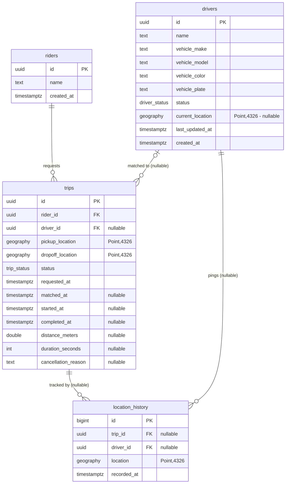

# Data Model & Database (Phase 1)

## Schema diagram



## Migration tool: node-pg-migrate (not Prisma)

Prisma's schema DSL has no first-class PostGIS support — a `geography(Point,4326)` column
has to be declared `Unsupported("geography(Point,4326)")`, and GIST indexes, native enum types,
and CHECK constraints all fall outside what `prisma migrate` can express, forcing raw
`prisma db execute` SQL for exactly the parts of this schema that matter most. That's fighting
the tool rather than using it.

node-pg-migrate is a thin wrapper over plain SQL/JS migrations: full control over PostGIS types,
GIST index methods, enum types, and CHECK constraints, with `up`/`down` reversibility as a
first-class concept rather than something bolted on. Since this service does most of its reads
through hand-rolled parameterized SQL (and Redis) rather than an ORM query builder, there's no
offsetting benefit from Prisma Client either.

## geography(Point,4326) vs geometry

`geography` is used for every location column (`drivers.current_location`,
`trips.pickup_location`/`dropoff_location`, `location_history.location`) instead of `geometry`.

- `geometry` treats coordinates as points on a flat plane. Distance/`ST_DWithin` calculations on
  `geometry` in SRID 4326 (lat/lng degrees) are planar-degree math, which is not a real-world
  distance and gets more wrong the further you get from the equator or the further apart the
  points are.
- `geography` computes distances on the sphere (technically a spheroid), so `ST_Distance`,
  `ST_DWithin`, and the `<->` KNN operator return actual meters. That's exactly what a
  nearest-driver query or "is this driver within 5km" check needs.
- The tradeoff: geography index/computation is somewhat more expensive per-operation than
  planar geometry math, and geography only supports a smaller operator set. For this project's
  read pattern (radius search, nearest-N, point-to-point distance) correctness matters more than
  the small constant-factor cost, so geography is the right default. If we ever need cheap planar
  operations at a single fixed scale (e.g. a pre-projected city-local grid), that's a case for
  adding a separate `geometry` column later — not a reason to use `geometry` here.

## Status fields: native enum types, not CHECK

`driver_status` (`online` / `offline` / `busy`) and `trip_status` (`requested` / `matched` /
`in_progress` / `completed` / `cancelled`) are Postgres `CREATE TYPE ... AS ENUM` types rather
than a `CHECK (status IN (...))` constraint on `text`. Both approaches reject invalid values at
the DB layer; enum was chosen because the legal value set lives in exactly one place (the type
definition), `\d+ driver_status` self-documents it, and it's simpler to extend later
(`ALTER TYPE ... ADD VALUE`) than editing a CHECK expression that would otherwise need to be
kept in sync across every table that uses it.

## Foreign keys & ON DELETE behavior

| Column                    | References  | On delete  | Why                                                                                                                                                                                    |
| ------------------------- | ----------- | ---------- | --------------------------------------------------------------------------------------------------------------------------------------------------------------------------------------- |
| `trips.rider_id`          | `riders`    | `RESTRICT` | Trips are the durable historical/billing record and future ETA-model training data (Phase 8/9). A rider must not be deletable while trips reference them — cascading the deletion would silently destroy that history. Forces an explicit decision elsewhere (e.g. soft-deleting riders) instead of silent data loss. |
| `trips.driver_id`         | `drivers`   | `SET NULL` | Same "don't destroy trip history" reasoning, but `driver_id` is already nullable (a trip can be unmatched), so detaching a deleted driver from their past trips is consistent with that and keeps the trip row intact for training/reporting. |
| `location_history.trip_id`   | `trips`   | `CASCADE`  | A location breadcrumb is meaningless without the trip it belongs to, and this table is the highest-volume, time-series-like one — there's no billing/legal reason to keep orphaned pings around, so cascading avoids a cleanup job. |
| `location_history.driver_id` | `drivers` | `CASCADE`  | Same reasoning — a ping tied to a permanently-deleted driver is no longer attributable to anyone. |

`location_history` also has a `CHECK (trip_id IS NOT NULL OR driver_id IS NOT NULL)` constraint:
a row with neither is an orphaned point with no owner, which the schema shouldn't allow.

## Indexes

- GIST indexes on every `geography` column (`drivers.current_location`,
  `trips.pickup_location`, `trips.dropoff_location`, `location_history.location`) — required for
  any indexed radius/nearest-neighbor search; see the query plan below proving this is actually
  used.
- B-tree on `drivers.status` and `trips.status` — both are filtered on constantly (e.g. "online
  drivers only", "requested trips only").
- B-tree on `trips.rider_id` and `trips.driver_id` — trip lookups by either party.
- B-tree on `location_history.recorded_at`, `.trip_id`, `.driver_id` — time-range queries and
  per-trip/per-driver history lookups.

## Verifying it yourself

```
cd core
npm run migrate:up      # apply all migrations to a fresh database
npm run migrate:down -- 6   # fully reverse them
npm run migrate:up      # bring the schema back
npm run seed             # idempotent: safe to run more than once
npm run db:explain       # EXPLAIN ANALYZE proving the GIST index is used, see below
```

## EXPLAIN ANALYZE: proving the GIST index is used

The seed script only creates 20 drivers — far too few for the planner to ever prefer an index
scan over scanning the whole (single-page) table. `core/scripts/explain-geo-query.ts` bulk-inserts
20,000 synthetic driver rows scattered across the same San Francisco bounding box inside a
transaction, runs `ANALYZE` + `EXPLAIN ANALYZE` against a real nearby-driver-style query, and then
rolls back — so running it never leaves extra rows behind (verified: `drivers` count is 20 both
before and after running it).

Query: online drivers within 3km of a point, nearest 10:

```sql
EXPLAIN (ANALYZE, BUFFERS, FORMAT TEXT)
SELECT id, name, current_location <-> ST_SetSRID(ST_MakePoint($1, $2), 4326)::geography AS distance_m
FROM drivers
WHERE status = 'online'
  AND ST_DWithin(current_location, ST_SetSRID(ST_MakePoint($1, $2), 4326)::geography, 3000)
ORDER BY current_location <-> ST_SetSRID(ST_MakePoint($1, $2), 4326)::geography
LIMIT 10;
```

Captured output, against a 20,020-row `drivers` table:

```
Limit  (cost=38652.43..38652.43 rows=1 width=42) (actual time=137.029..137.106 rows=10 loops=1)
  Buffers: shared hit=548
  ->  Sort  (cost=38652.43..38652.43 rows=1 width=42) (actual time=136.888..136.907 rows=10 loops=1)
        Sort Key: ((current_location <-> '0101000020E6100000AE47E17A149A5EC0CDCCCCCCCCE44240'::geography))
        Sort Method: top-N heapsort  Memory: 26kB
        Buffers: shared hit=548
        ->  Bitmap Heap Scan on drivers  (cost=353.29..38652.42 rows=1 width=42) (actual time=128.032..135.169 rows=2162 loops=1)
              Recheck Cond: (status = 'online'::driver_status)
              Filter: st_dwithin(current_location, '0101000020E6100000AE47E17A149A5EC0CDCCCCCCCCE44240'::geography, '3000'::double precision, true)
              Rows Removed by Filter: 861
              Heap Blocks: exact=386
              Buffers: shared hit=545
              ->  BitmapAnd  (cost=353.29..353.29 rows=3030 width=0) (actual time=3.322..3.339 rows=0 loops=1)
                    Buffers: shared hit=64
                    ->  Bitmap Index Scan on idx_drivers_status  (cost=0.00..137.85 rows=11942 width=0) (actual time=0.987..0.988 rows=11942 loops=1)
                          Index Cond: (status = 'online'::driver_status)
                          Buffers: shared hit=11
                    ->  Bitmap Index Scan on idx_drivers_current_location_gist  (cost=0.00..215.19 rows=5079 width=0) (actual time=2.059..2.059 rows=5103 loops=1)
                          Index Cond: (current_location && _st_expand('0101000020E6100000AE47E17A149A5EC0CDCCCCCCCCE44240'::geography, '3000'::double precision))
                          Buffers: shared hit=53
Planning:
  Buffers: shared hit=121
Planning Time: 11.166 ms
Execution Time: 138.123 ms
```

The planner combines a `Bitmap Index Scan` on `idx_drivers_status` with a `Bitmap Index Scan` on
`idx_drivers_current_location_gist` (via `BitmapAnd`) — the GIST index is what makes the
`ST_DWithin` bounding-box check (`current_location && _st_expand(...)`) indexed rather than a
sequential scan over all 20,020 rows. No `Seq Scan` appears anywhere in the plan.
